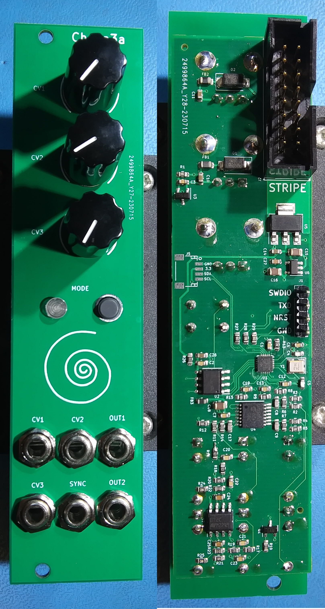

# cheep3a
An inexpensive Eurorack audio generator



## Abstract
This project is an extension of previous "Cheep" Eurorack modules which have been
built as demonstrations for simple, low-cost audio generators using low-end MCUs
and DACs. Cheep3a targets the recently introduced CH32V003 RISC-V based MCU from
WCH Inc. in order to explore the feasibility of audio generation with a sub-$1.00
microcontroller.

## Features
Cheep3a provides the following features:
* Three Control Voltage inputs with 10-bit 10Vpp instantaneous range over a +/-11V
adjustable range using offset potentiometers.
* One digital input for trigger/gate/sync.
* Two +/-5V audio outputs with 16-bit resolution and 48kHz sample rate.
* One mode select button
* One RGB LED for mode indication.
* 4-pin programming interface, including 1-line WCH standard SWDIO, UART TX and
Reset signal.
* JST SH-4 connector with optional I2C signals compatible with StemmaQT/Qwiic
connections for off-board expansion.
* Standard 16-pin Eurorack power with shrouded header and +/-12V supply.

## Firmware
Firmware included in this project supports seven operating modes with various
audio signal outputs in each mode:
1. [Red] Two independent sine oscillators with amplitude control - 10Hz - 10kHz
frequency range.
2. [Green] Same as 1 but with 0.3Hz - 300Hz frequency range.
3. [Yellow] One sine oscillator with two outputs, phase offset and amplitude
control - 10Hz - 10kHz frequency range.
4. [Blue] Pulse wave oscillator with two outputs and independent PWM
controls - 10Hz - 10kHz frequency range.
5. [Magenta] 2-operator FM with index and ratio controls. Mod and Carrier outputs.
6. [Cyan] Two independent clocked noise outputs.
7. [White] White and Pink noise outputs.

Mode selection is stored in the MCU's on-chip flash memory and will persist
across power cycles.

### Building Firmware
The Cheep3a firmware is based on [cnlohr's "ch32v003fun"](https://github.com/cnlohr/ch32v003fun)
project and expects that the github directory for that project is located in
an adjacent directory in order for the make-based build system to operate
correctly. A recent RISC-V GCC toolchain is also required and once you have
that installed (and in your search path) the following steps should work:

```
git clone git@github.com:emeb/cheep3a.git
git clone git@github.com:cnlohr/ch32v003fun.git
cd cheep3a/firmware
make
```

## Hardware
Version 0.1 of the hardware was fabbed and assembled at JLCPCB at modest cost and
all unsupported components (pots, jacks, connectors, LED and button) were added
by hand. Aside from a few minor layout errors which were easily corrected, the
system performed as expected.

### Building Hardware
The hardware can be recreated with the following steps:
1. Open the PCB project in Kicad and generate Gerber and Drill files. Zip them
up together and submit to the PCB fab of choice.
2. Generate component placement information and format as required by your
PCB assembly house.
3. The JLCPCB formatted BOM is included in the hardware directory and maps to
components that were available at the time I designed this board. If you don't
use JLCPCB the BOM may need to be reformatted and substitutions of parts will
likely be necessary.
4. Follow the submission process for your PCB house, including correction of
placement and approval of components.

## Lessons Learned
The CH32V003 MCU performs well for simple audio generation tasks but falls
somewhat short for more complex DSP. Hardware support for good digital audio is
impaired by the overall low CPU clock speed and limited memory capcity, as well
as the need to "work around" the lack of true I2S serial audio interfacing. The
biggest shortcoming however is the subset RV32E RISC-V CPU which doesn't provide
hardware multiply and thus significantly increases the cost of even simple DSP
operations needed for good-quality audio generation.

